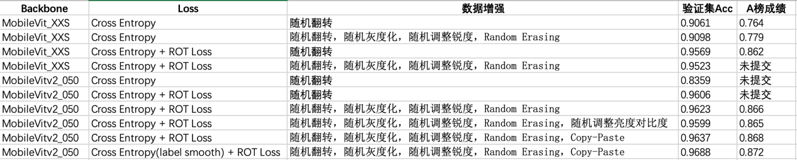

# 百度网盘AI大赛-文档图像方向识别赛方案

## 概述
我们使用了MobileVitv2_050作为我们方法的backbone，使用了我们提出的自监督ROT Loss和Cross Entropy作为损失函数进行训练。我们将模型量化为FP16半精度模型，最终模型大小为2.2M。

## 快速开始
模型训练
~~~
python train.py \
    --env mobilevitv2_050 \
    --train_set ../datasets/trainset_v3/ \
    --train_list ../datasets/trainset_v3/train_list.txt \
    --valid_set ../datasets/test_A/images \
    --valid_list ../datasets/test_A/label.txt \
    --model mobilevitv2_050 \
    --epochs 120 \
    --batch_size 128 \
    --lr 0.001 \
    --min_lr 1e-5 \
    --warmup \
    --warmup_epochs 10 \
    --rot_loss \
    --rotLoss_weight 0.1 \
    --label_smooth 0.1 \
    --fp16 \
    --copypaste \
    --weight_decay 1e-5 
    # 没有保留checkpoint 
~~~

导出onnx模型（winmltools最好安装在新的环境中，不然可能会导致冲突）
~~~
python export_onnx.py \
    --checkpoint ./log/mobilevitv2_050/models/model_best.pth
~~~

转换为FP16半精度模型
~~~
python Tofp16.py
~~~

模型预测
~~~
python predict6.py ./datasets/test_A/images/ ./predict.txt
~~~

## 训练数据
+ 文档图片

    英文文档图片 DocBacnk
    
    中文文档图片 CDLA_DATASET

    百度网盘AI大赛——模糊文档图像恢复赛道训练数据的GroundTruth图片

    使用爬虫爬取的百度百科截图
+ 普通图片

    VOC2007
    
    VOC2012
    
    food-101
    
    Animals_with_Attributes2
    
    WIDER

## 模型参数
+ 数据增强

    随机剪裁RandomCrop，随机翻转RandomHorizontalFlip, 随机灰度化RandomGrayscale，随机调整锐度RandomAdjustSharpness，Random Erasing，Copy-Paste

+ 训练参数
    ~~~
    --epochs 120 \
    --batch_size 128 \
    --lr 0.001 \
    --min_lr 5e-5 \
    --warmup \
    --warmup_epochs 10 \
    --rot_loss \
    --rotLoss_weight 0.1 \
    --label_smooth 0.1 \
    --fp16 \
    --copypaste \
    --weight_decay 1e-5 
    ~~~

## 消融实验

  

## 总结
可以发现我们提出的自监督ROT Loss可以显著提升模型的性能，遗憾的是，虽然我们在A榜取得了第一名0.872的成绩，大大领先之后的选手，但是我们在B榜只获得了第6名。

我们认为这是因为该任务是和数据集高度相关的（例如我们发现对于一些包含动物与食物的图片，如果模型在训练中没有见过类似的图片，那么是很难正确预测图片的方向的）。因此训练数据与测试数据的分布的差异的影响会远远大于模型本身性能的影响，但是官方并没有提供统一的训练数据且B榜只能提交一次，这就导致B榜的提交有点类似开盲盒，谁第一次提交的模型的训练数据更接近测试集谁的成绩就会更好。可以发现A榜的成绩与B榜的成绩并没有非常相关，选手排名波动都非常大。

我们相信如果使用相同的训练数据来训练，我们的模型能获得非常有竞争力的性能！